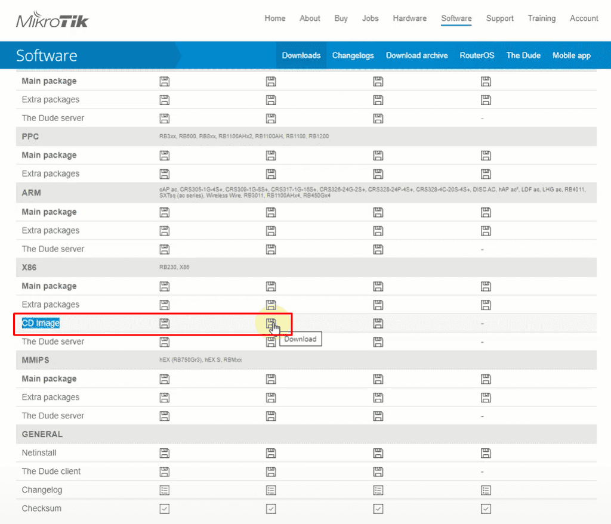
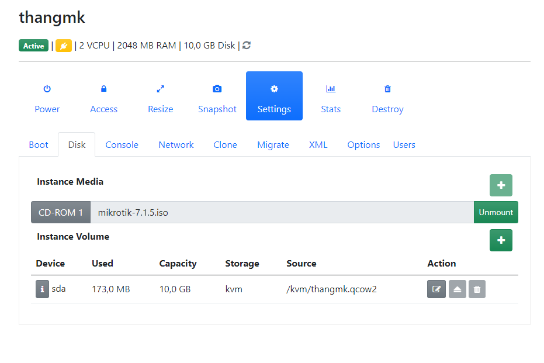
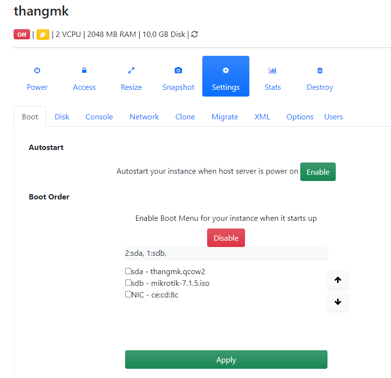
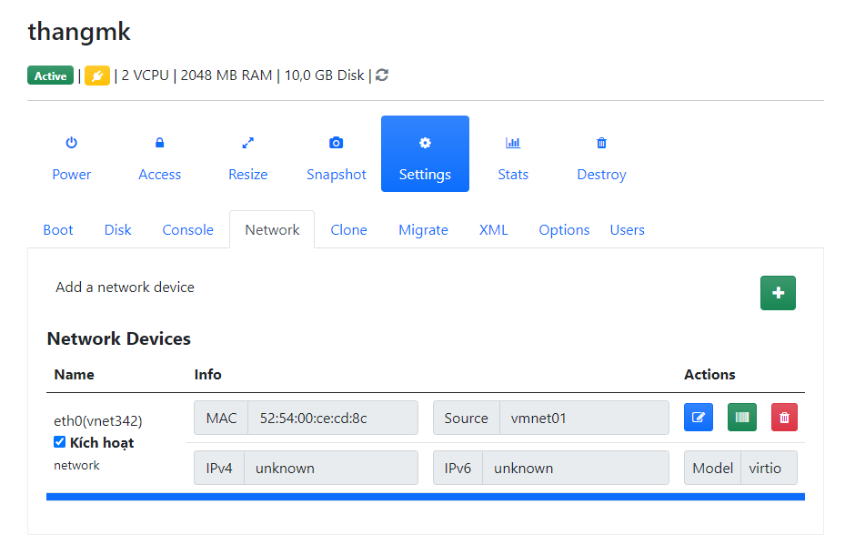
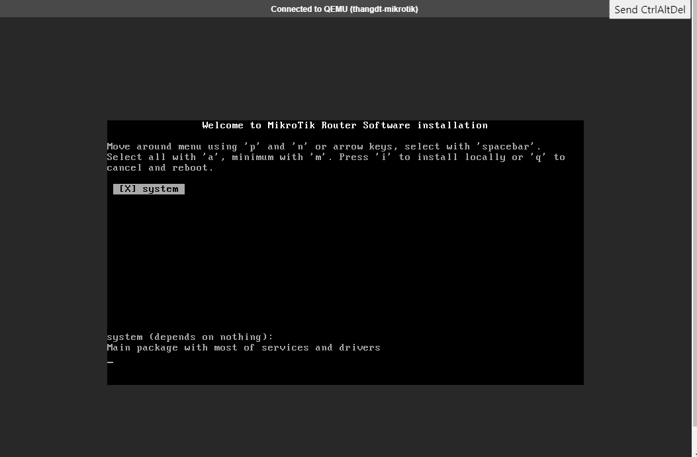
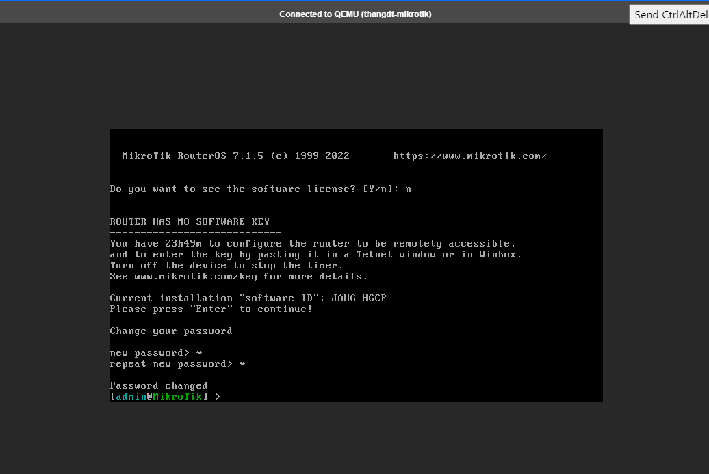

# Giới thiệu  
- MikroTik RouterOS là hệ điều hành dùng cho phần cứng RouterBOARD của MikroTik
- RouterOS có thể cài đặt trên một máy tính bình thường để biến máy tính đó thành một con router tích hợp rất nhiều chức năng như: routing, firewall, bandwidth management, wireless access point, load balacing, hotspot gateway, VPN server…v.v.
# Install RouterOS

- Ở đây tôi thực hành trên WebVirtCloud

- Bước 1: Truy cập vào trang chủ Mikrotek https://mikrotik.com/download , Tại mục RouterOS tìm đến dòng CD image và chọn tải File cột thứ 2 ( *.ISO ) như hình
 

  - Ở đây tôi đã có sẵn file iso bản RouterOSv7 trên WebVirtCloud.
- Bước 2 Cài đặt RouterOS trên WebVirtCloud. 
  - Thiêt lập 
    - Tạo Instances có các thiết lập như sau  
    -  Chọn disk và file ISO tải được từ trang chủ Lưu ý khi chọn volume chọn bus dạng scsi

       

    - Sắp xếp thứ tự boot

      
        
    - Chọn chọn card network

      
  - Khởi động OS
    - Nhập i, y để cài đặt OS

      
    - Reboot lại hệ thống  
      - Màn hình hiển thị đang nhập, mặc định thông tin đăng nhập
         
         Username: admin
         
         Password: để trống ( bấm enter )

         Chọn n để không nhập license Mik OS
         
         Nhập pass mới.

      

- Bước 3. Thiết lập địa chỉ ip 
  - Thêm địa chỉ network: 
    
        ip address add address=10.10.1.0/24 interface=ether1

  - Tạo NAT rule

        ip firewall nat add chain=srcnat action=masquerade out-interface=ether1

  - Thêm gateway

        ip route add gateway=10.10.1.1
 

