# 1. Yêu cầu bài toán

- Máy chủ VM-01 sử dụng mạng LAN 10.10.1.0/24
- MikroTik-01 có cùng mạng LAN với VM-01 
- Máy chủ VM-02 sử dụng mạng LAN 10.10.2.0/24
- MikroTik-02 có cùng mạng LAN với VM-02

- Cấu hình VPN sử dụng IPsec MikroTik để VM-01 và VM-02 kết nối mạng LAN với nhau.
# 2. Mô hình triển khai

- Mô hình Site to Site
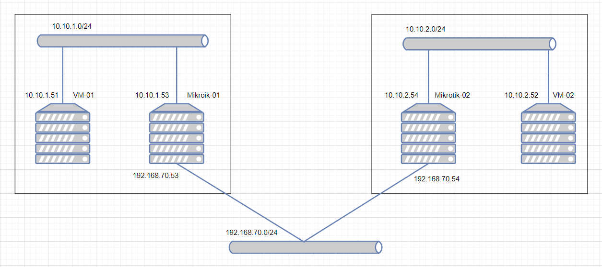

# 3. IP planning 

Name | OS | Interface | IP | Cấu hình phần cứng
---|---|---|---|---
VM-01 |Ubuntu 20.04 | enp2s0 | 10.10.1.51 | Ram 2Gb, 2 core
VM-02 |Centos 8  | enp2s0 | 10.10.2.52 | Ram 2Gb, 2 core
Mikrotik-01 | RouterOSv7 | enp1s0 | 192.168.70.53 | Ram 2Gb, 2 core
 | |  | enp2s0 | 10.10.1.53 | 
Mikrotik-02 | RouterOSv7 | enp1s0 | 192.168.70.54 | Ram 2Gb, 2 core
 | |  | enp2s0 | 10.10.2.54 | 

# 4. Cấu hình VPN 

- Ta có thể cấu hình VPN theo 2 cách là thông qua giao diện Winbox hoặc nhập lệnh từ console. Dưới đây tôi thực hiện theo cả 2 cách 
- **Lưu ý**: Cấu hình trên các MikroTik cần phải giống nhau về các thuật toán và các chế độ.

## 4.1 Cấu hình trên Mikrotik-01 

- 1.Từ phần mềm winbox, truy cập vào Mikrotik ta chọn IP → IPsec và chọn tab profiles
  - Xây dựng một kênh truyền bảo mật giữa 2 điểm đầu cuối  
   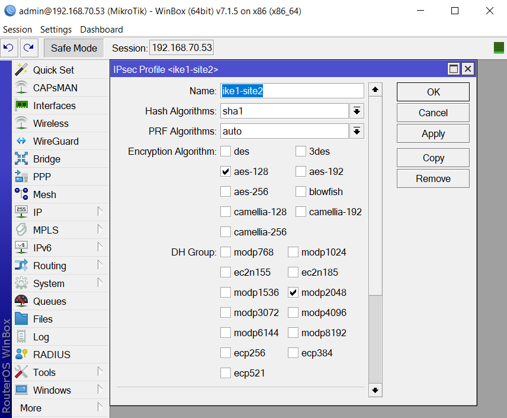

  - Trong đó 
    - **Hash Algorithms**: `sha1` - Thuật toán hàm băm 
    - **Encryption Algorithms**: `ase-128` - Thuật toán mã hóa
    - **DH-group**: `modp2048` - Diffie-Hellman giao thức trao đổi khóa

  - Sử dụng lệnh:

        / ip ipsec profile add name=ike1-site2 hash-algorithm=sha1 enc-algorithm=aes-128 dh-group=modp2048 
- 2.Tạo propocal trong tab propocals
  - Xây dựng phương thức truyền gói tin 
   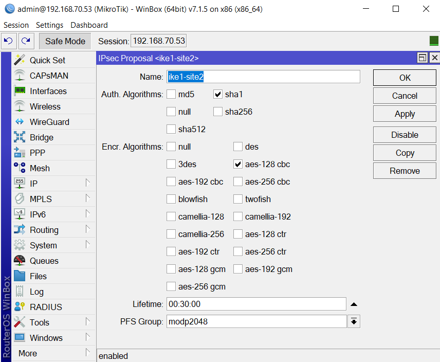

  - Trong đó: 
    - **Name** : `ike1-site2` - tên của proposal
    - **Auth. Alorithms**: `sha1` - thuật toán hàm khóa xác thực
    - **Encr. Alorithms**: `aes-128 cbc` - Thuật toán mã hóa
    - **PFS Group**: `modp2048` - nhóm Diffie-Helman được sử dụng cho Perfect Forward Secrecy
    - **lifetime**: thời gian sử dụng SA trước khi vất bỏ 

  - Sử dụng lệnh:

        /ip ipsec proposal add name=ike1-site2 auth-algorithms=sha1 enc-algorithms=aes-128-cbc  pfs-group=modp2048 

- 3.Tạo peer trong tab peers
  -	Xác định điểm kết nối và phương thức mã hóa giữa 2 điểm đầu cuối
   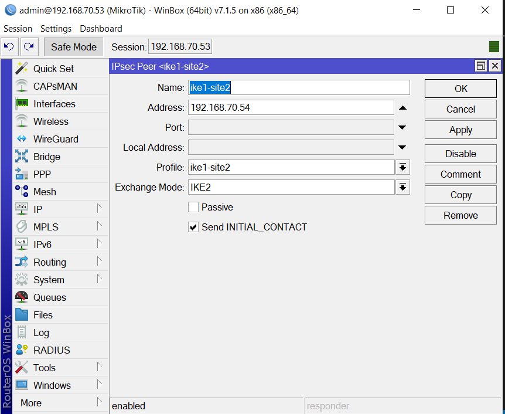
   
  - Trong đó:
    - **Name**: `ike1-site2` tên của peer    
    - **Address**: `192.168.70.54` - là địa chỉ WAN của MikroTik-02 kết nối đến
    - **Profile**: `ike1-site2` - Profile mà peer áp dụng 
    - **Exchange Mode**: `IKE2` - Là mã định danh duy nhất giữa các máy chủ với nhau   

  - Sử dụng lệnh:

        /ip ipsec peer add address=192.168.70.54 name=ike1-site2 profile=ike1-site2 exchange-mode=ike2

- 4.Chọn tab identities và tạo  identity mới
  -	Xác thực giữa danh tính giữa 2 bên đối tác
   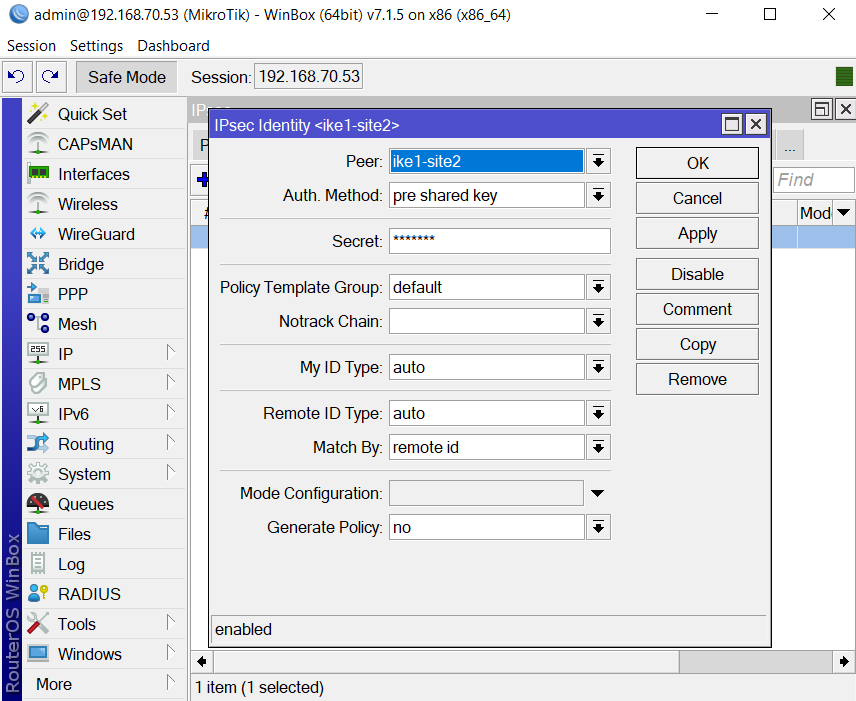

  - Trong đó:
    - **Name**: `ike1-site2` tên của peer mà identity áp dụng    
    - **Auth. Method**: `per shared key` - lựa chọn phương pháp xác thực 
    - **Secret**: Nhập chuỗi bí mật, được sử dụng để định danh đối tác 
  - Sử dụng lệnh:

        /ip ipsec identity add peer=ike1-site2 secret=123@123

- 5.Trong tab Policies tạo mới một Policy
  - Định tuyến đường đi truyền gói tin  
   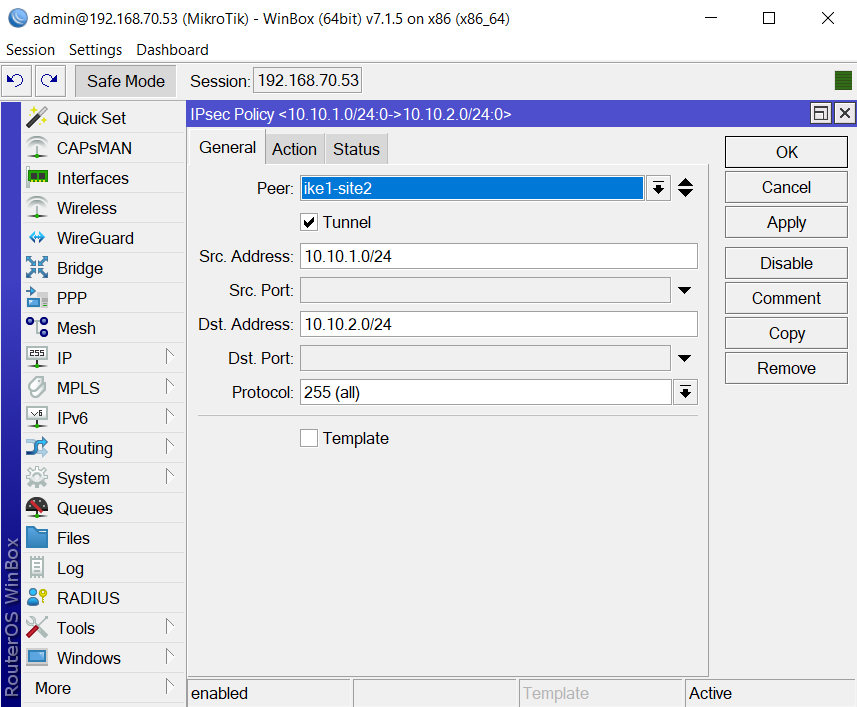
  
  - Chuyển sang tab Action
 
    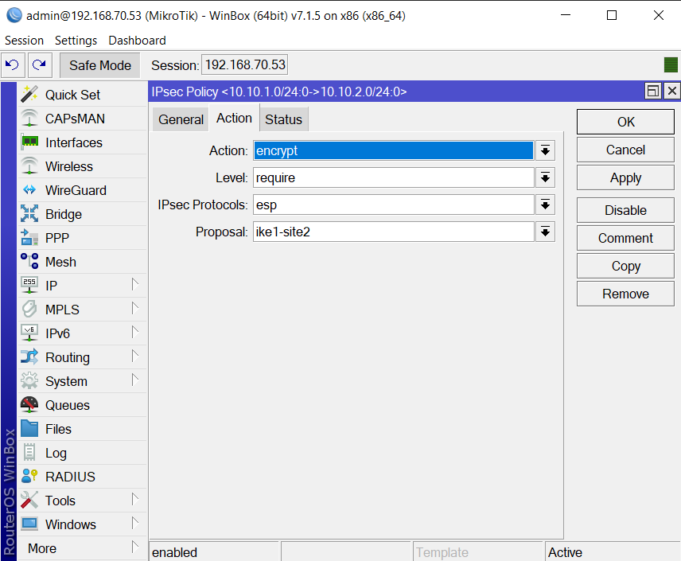

  - Trong đó: 
    - **tunnel**: `yes` - Chỉ định sử dụng chế độ tunnel, các gói ip gốc được đóng gói trong một gói ip mới và chúng đều được xác thực.
    - **Src. Address**: `10.10.1.0/24` - Địa chỉ dải mạng của VM-01. Áp dụng khi sử dụng tunnel
    - **Dst. Address**: `10.10.2.0/24` - Địa chỉ dải mạng của VM-02. Áp dụng khi sử dụng tunnel
    - **Action**: `encrypt` - Mã hóa dữ liệu truyền thông qua proposal được chọn  
    - **Level**: `require` - Chỉ định công việc khi không tìm thấy SA cho prolicy. 
    - **IPsec protocals**: `esp` - Lựa chọn giao thức IPsec.
  - Sử dụng lệnh:

        /ip ipsec policy add src-address=10.10.1.0/24 src-port=any dst-address=10.10.2.0/24 dst-port=any tunnel=yes action=encrypt proposal=ike1-site2 peer=ike1-site2

- 6.NAT làm thay đổi địa chỉ nguồn trước khi mã hóa, chúng ta cần thiết lập không cho NAT làm việc cho dải IP này. 
  - Mỗi khi có dữ liệu trao đổi giữa 2 mạng 10.10.1.0/24 với mạng 10.10.2.0/24, NAT không hoạt động và các dữ liệu trao đổi ngang hàng với nhau.
  - Thêm 2 rule srcnat và dstnat trong IP → Firewall → NAT với action là accept mặc định và kéo lên trên rule NAT Internet: 
  - **Lưu ý**: Phải đặt 2 dòng NAT này đứng đầu  
    
    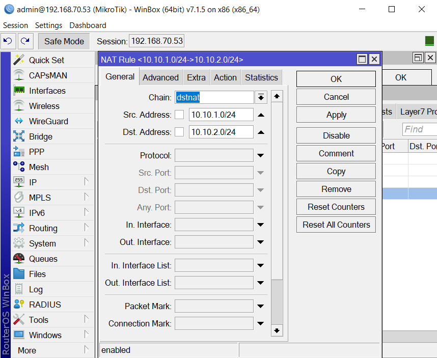

  - Sử dụng lệnh:

        /ip firewall nat add chain=srcnat action=accept place-before=0 src-address=10.10.1.0/24 dst-address=10.10.2.0/24  #place-before=0 để đưa rule lên đầu danh sách
        /ip firewall nat add chain=dstnat action=accept place-before=0 src-address=10.10.1.0/24 dst-address=10.10.2.0/24  #place-before=0 để đưa rule lên đầu danh sách

## 4.2 Cấu hình trên Mikrotik-02

- 1.Từ phần mềm winbox, truy cập vào Mikrotik ta chọn IP → IPsec và chọn tab profiles

   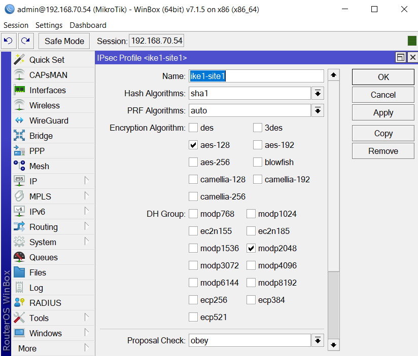

  - Sử dụng lệnh:

        /ip ipsec profile add dh-group=modp2048 enc-algorithm=aes-128 name=ike1-site1 

  - Trong đó 
    - **Hash Algorithms**: `sha1` - Thuật toán hàm băm 
    - **Encryption Algorithms**: `ase-128` - Thuật toán mã hóa
    - **DH-group**: `modp2048` - Diffie-Hellman giao thức trao đổi khóa

- 2.Tạo propocal trong tab propocals

   

  - Sử dụng lệnh:

        /ip ipsec proposal add enc-algorithms=aes-128-cbc name=ike1-site1 pfs-group=modp2048

  - Trong đó: 
    - **Name** : `ike1-site1` - tên của proposal
    - **Auth. Alorithms**: `sha1` - thuật toán hàm khóa xác thực
    - **Encr. Alorithms**: `aes-128` cbc - Thuật toán mã hóa
    - **PFS Group**: `modp2048` - nhóm Diffie-Helman được sử dụng cho Perfect Forward Secrecy
    - **lifetime**: thời gian sử dụng SA trước khi vất bỏ 

- 3.Tạo peer trong tab peers

   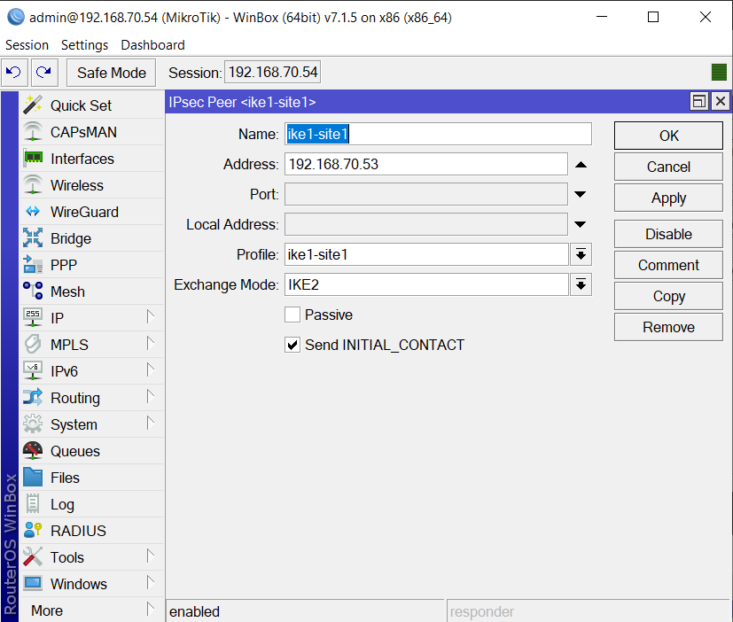

  - Trong đó:
    - **Name**: `ike1-site1` tên của peer    
    - **Address**: `192.168.70.54` - là địa chỉ WAN của MikroTik-02 kết nối đến
    - **Profile**: `ike1-site1` - Profile mà peer áp dụng 
    - **Exchange Mode**: `IKE2` - Là mã định danh duy nhất giữa các máy chủ với nhau   

  - Sử dụng lệnh:

        /ip ipsec peer add address=192.168.70.53 name=ike1-site1 profile=ike1-site1 exchange-mode=ike2

- 4.Chọn tab identity và tạo identity mới

   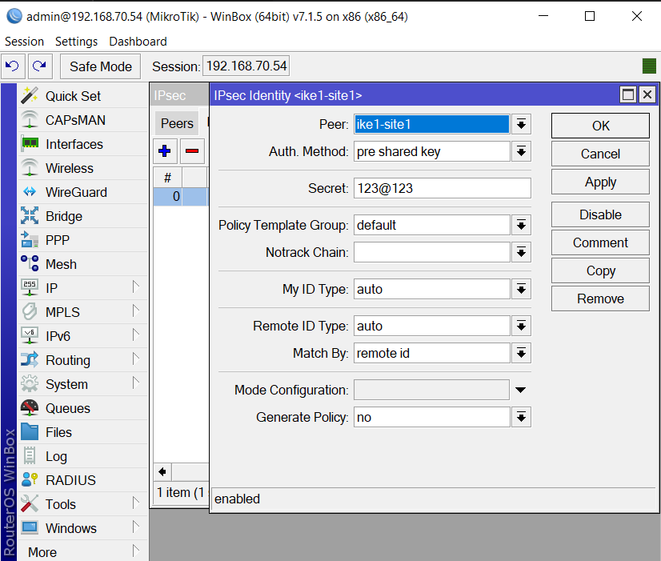

  - Trong đó:
    - **Name**: `ike1-site1` tên của peer mà identity áp dụng    
    - **Auth. Method**: `per shared key` - lựa chọn phương pháp xác thực 
    - **Secret**: Nhập chuỗi bí mật, được sử dụng để định danh đối tác 
  - Sử dụng lệnh:

        /ip ipsec identity add peer=ike1-site1 secret=123@123

- 5.Trong tab Policies tạo mới một Policy

   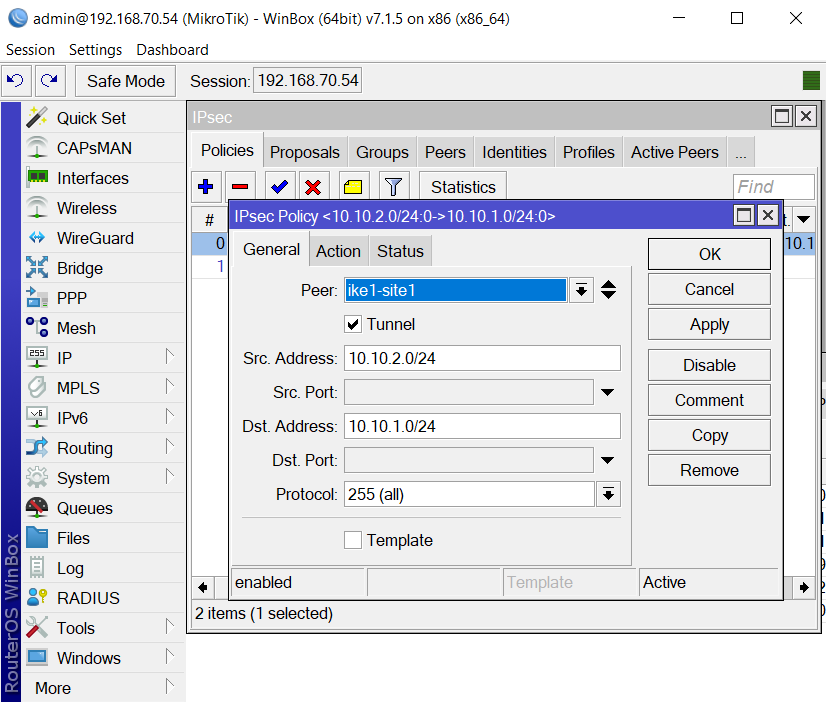

  - Chuyển sang tab Action, Chọn Action, Level, IPsec protocals, Proposal:

   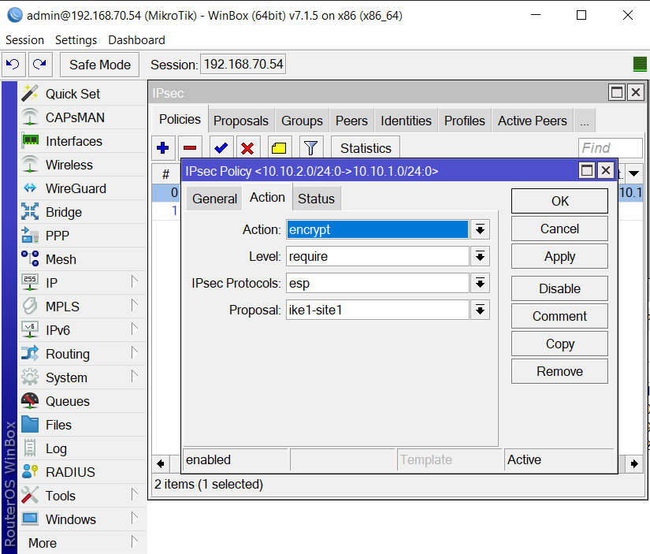
 
  - Trong đó: 
    - **tunnel**: `yes` - Chỉ định sử dụng chế độ tunnel, các gói ip gốc được đóng gói trong một gói ip mới và chúng đều được xác thực.
    - **Src. Address**: `10.10.2.0/24` - Địa chỉ dải mạng của VM-02. Áp dụng khi sử dụng tunnel
    - **Dst. Address**: `10.10.1.0/24` - Địa chỉ dải mạng của VM-01. Áp dụng khi sử dụng tunnel
    - **Action**: `encrypt` - Chỉ định công việc của package phù hợp với prolicy. Cho phép chuyển đổi được sử dụng trong chính sách (SA)
    - **Level**: `require` - Chỉ định công việc khi không tìm thấy SA cho prolicy. 
    - **IPsec protocals**: `esp` - Lựa chọn giao thức IPsec.
  - Sử dụng lệnh:

        /ip ipsec policy add src-address=10.10.2.0/24 src-port=any dst-address=10.10.1.0/24 dst-port=any tunnel=yes action=encrypt proposal=ike1-site1 peer=ike1-site1

- 6.Thêm rule NAT trong firewall
  - Thêm 2 rule srcnat và dstnat trong IP → Firewall → NAT với action là accept mặc định và kéo lên trên rule NAT Internet:

   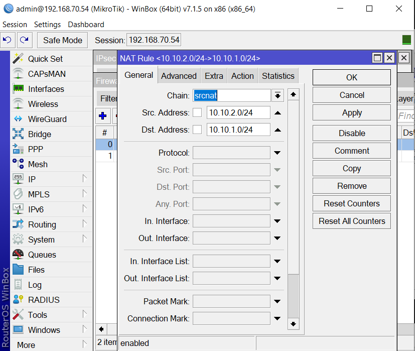
   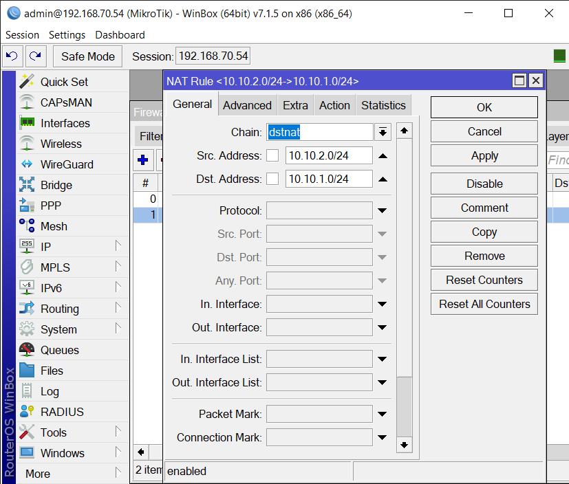

  - Sử dụng lệnh:

        /ip firewall nat add chain=srcnat action=accept place-before=0 src-address=10.10.2.0/24 dst-address=10.10.1.0/24
        /ip firewall nat add chain=dstnat action=accept place-before=0 src-address=10.10.2.0/24 dst-address=10.10.1.0/24

- Ta phải thêm route tại 2 node cho phép VM-01 được kết nối đến Mikrotik-02 và VM-02 được kết nối đến Mikrotik-01
  - Tại VM-01 thêm dải 10.10.2.0/24 thông qua địa chỉ 10.10.1.53 trên dev enp2s0

        /ip route add 10.10.2.0/24 via 10.10.1.53 dev enp2s0

  - Tại VM-02 thêm dải 10.10.1.0/24 thông qua địa chỉ 10.10.2.54 trên dev enp2s0

        /ip route add 10.10.1.0/24 via 10.10.2.54 dev enp2s0

- Kiểm tra kết nối:

  - Từ VM-01 ta ping đến VM-02 

        ping 10.10.2.52

   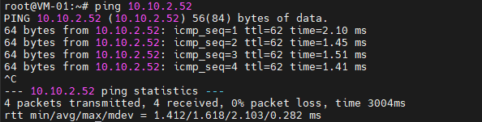

  - Từ VM-02 ta ping đến VM-01

        ping 10.10.1.51

   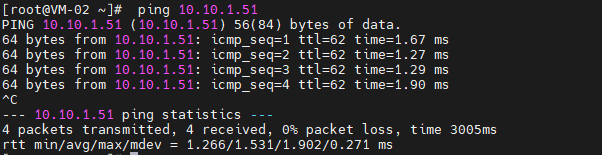

