# 1. Yêu cầu bài toán

- Máy chủ VM-01 sử dụng mạng LAN 10.10.1.0/24
- MikroTik có cùng mạng LAN với VM-01 
- Máy chủ VM-02 sử dụng mạng LAN 10.10.2.0/24
- Pfsense có cùng mạng LAN với VM-02

- Cấu hình VPN để VM-01 và VM-02 kết nối mạng LAN với nhau.
# 2. Mô hình triển khai

- Mô hình Site to Site
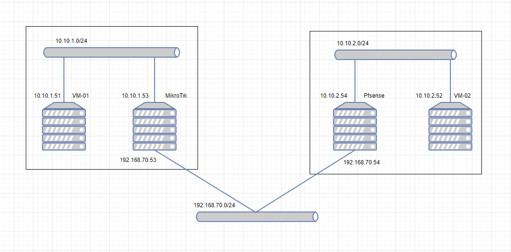

# 3. IP planning 

Name | OS | Interface | IP | Cấu hình phần cứng
---|---|---|---|---
VM-01 |Ubuntu 20.04 | enp2s0 | 10.10.1.51 | Ram 2Gb, 2 core
VM-02 |Centos 8  | enp2s0 | 10.10.2.52 | Ram 2Gb, 2 core
Mikrotik | RouterOSv7 | enp1s0 | 192.168.70.53 | Ram 2Gb, 2 core
 | |  | enp2s0 | 10.10.1.53 | 
Pfsense | pfSense-CE-2.5.1 | enp1s0 | 192.168.70.54 | Ram 2Gb, 2 core
 | |  | enp2s0 | 10.10.2.54 | 

# 4. Cấu hình VPN 

- Ta có thể cấu hình VPN theo 2 cách là thông qua giao diện Winbox hoặc nhập lệnh từ console. Dưới đây tôi thực hiện theo cả 2 cách 
- **Lưu ý**: Cấu hình trên các MikroTik cần phải giống nhau về các thuật toán và các chế độ.

## 4.1 Cấu hình Phase 1 

### 4.1.1 Trên Pfsense

1.  Từ GUI trỏ đến PN -> IPSec -> Tunnel. Sau đó chọn ADD P1 để bắt đầu thêm phase 1 . Sau đó bắt đầu điền thông tin
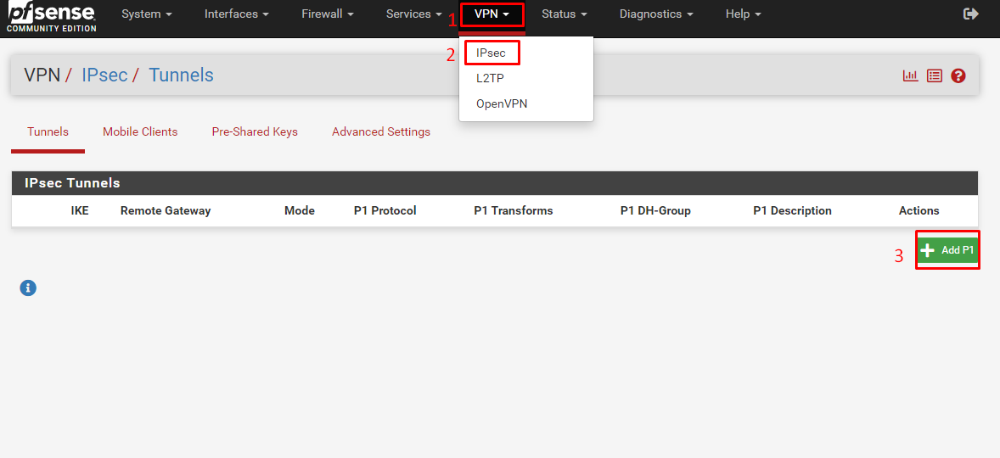

- **Key Exchange Version**: `IKEv2` mã định danh sử dụng giữa 2 máy chủ    
- **Internet Protocol**: `IPv4` sử dung giao thức
- **Interface**: `WAN` 
- **Remote Gateway** : `192.168.70.53` IP WAN của MikroTik 
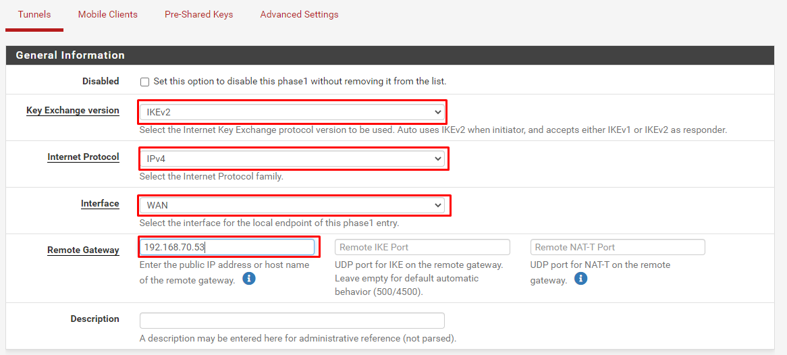

2. Lựa chọn phương thức xác thực cho phase 1 (Phase 1 Proposal (Authentication)) 

- **Authentication Method**: `Mutual PSK`
- **My identifier**: `My IP Address`
- **Peer identifier**: `Peer IP Address`
- **Pre-Shared Key**: `123` nhập chuỗi xác thực được sử dụng giữa 2 nền tảng 
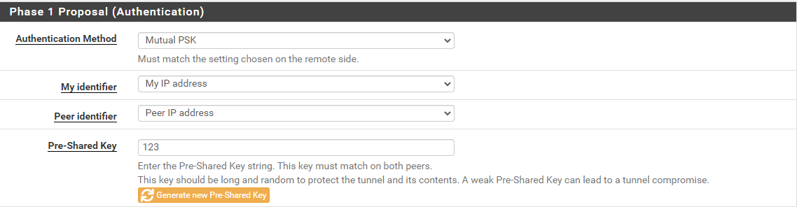

3. Lựa chọn thuật toán mã hóa cho phase 1  ( Phase 1 Proposal (Encryption Algorithm))

- **Algorithm**: ``3DES`` lựa chọn thuật toán mã hóa  
- **Hash**: ``SHA1`` lựa chọn thuật toán hàm băm 
- **DH Group**: ``2 (1024 bit)`` Diffie-Hellman giao thức trao đổi khóa
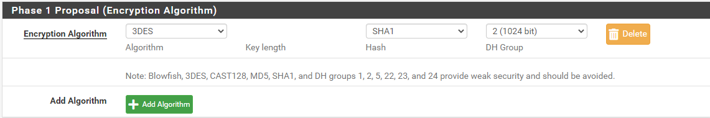

4. Tùy chỉnh các tùy chọn nâng cao và chọn Save để lưu 

- Ở đây tôi sử dụng cấu hình mặc định, bạn có thể tùy chỉnh theo nhu cầu của bạn.
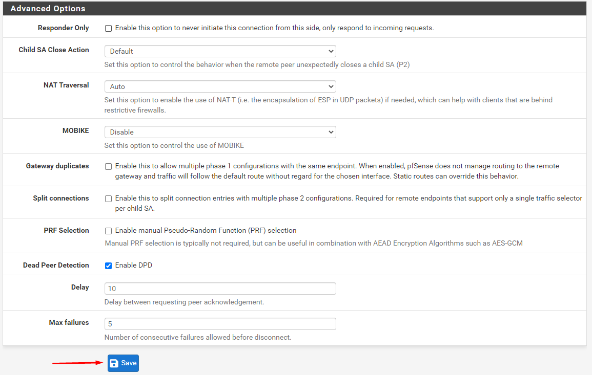
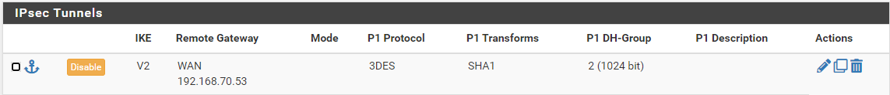

### 4.1.1 Trên MikroTik 

1.  Từ phần mềm winbox, truy cập vào Mikrotik ta chọn IP → IPsec → Profiles. Tạo trong profile để cập nhập cấu hình pfsense  

    - **Hash Algorithms**: `sha1` - Thuật toán hàm băm 
    - **Encryption Algorithms**: `3des` - Thuật toán mã hóa
    - **DH-group**: `modp1024` - Diffie-Hellman giao thức trao đổi khóa
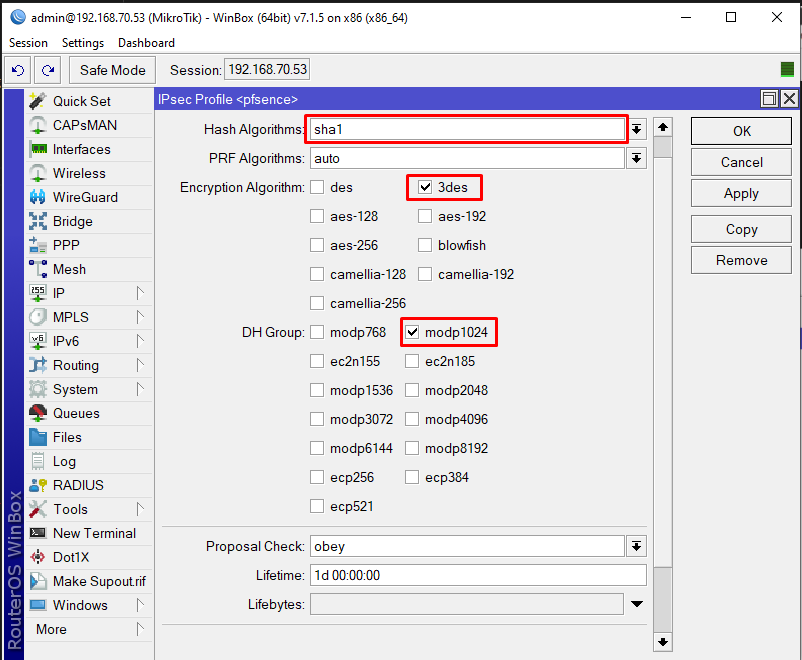

2. Tại tab peers tạo peer mới tương ứng 

    - **Name**: `pfsense` tên của peer    
    - **Address**: `192.168.70.54` - là địa chỉ WAN của MikroTik-02 kết nối đến
    - **Profile**: `pfsense` - Profile mà peer áp dụng 
    - **Exchange Mode**: `IKE2` - Là mã định danh duy nhất giữa các máy chủ với nhau   
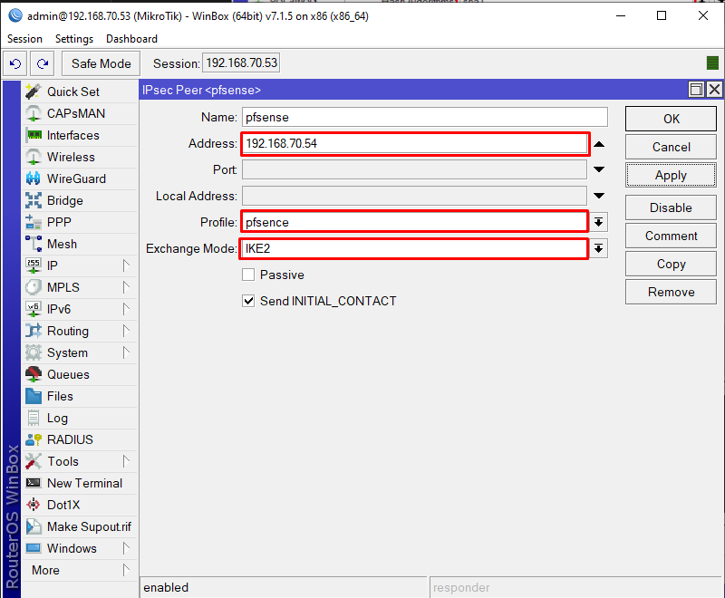

3. Chọn tab identities và tạo identity mới

- Xác thực giữa danh tính giữa 2 bên đối tác

    - **Name**: `pfsense` tên của peer mà identity áp dụng    
    - **Auth. Method**: `per shared key` - lựa chọn phương pháp xác thực tương ứng với pfsense
    - **Secret**: Nhập chuỗi bí mật, được sử dụng để định danh pfsense
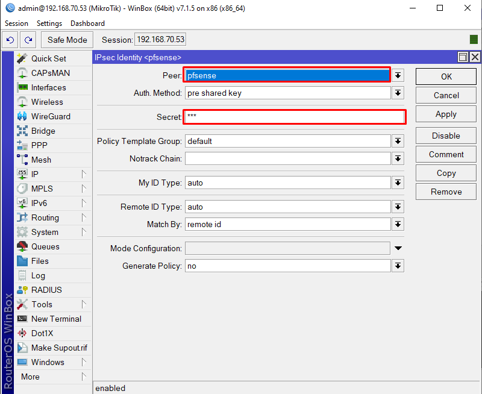

## 4.2 Cấu hình trên Phase 2 
- Phase 2 là nơi chúng tôi cho firewall  biết cách xác định gói nào cần được mã hóa và gửi đến đồng đẳng từ xa

### 4.2.1 Trên Pfsense
1. Sau khi kết thúc cấu hình phase 1. Tại giao diện của VPN -> IPsec chọn Show Phase 2 Entries và Add p2 

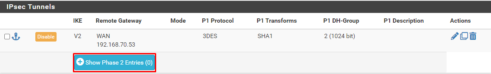
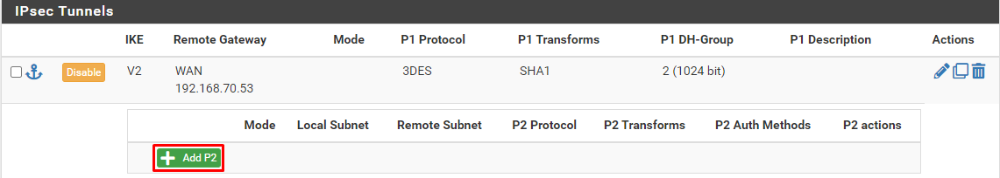

2. Điện thông tin chung trong General Information

- **Mode**: `Tunnel IPv4`
- **Local Network**: `LAN Subnet`
- **Remote Network**:`10.10.1.0/24` mạng con LAN đằng sau Mikrotik mà bạn muốn truy cập từ pfSense
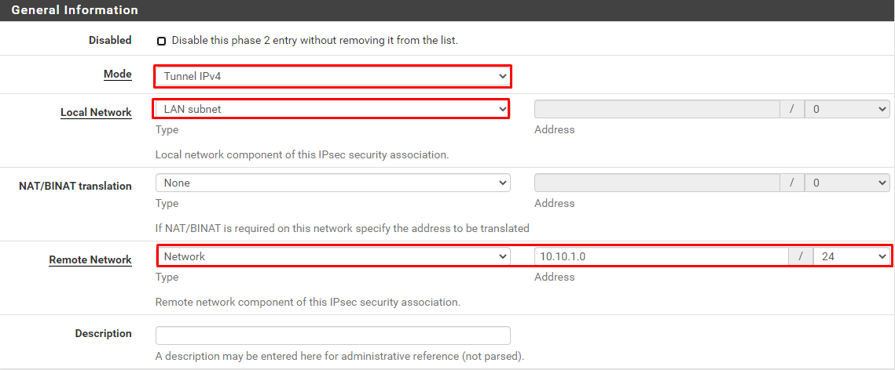

3. Điền thông tin Phase 2 Proposal (SA/Key Exchange) 

- **Protocol**: `EPS`  - Lựa chọn giao thức IPsec
- **Encryption Algorithms**: `3DES` Thuật toán mã hóa  
- **Hash Algorithms**: `SHA1`- Thuật toán hàm băm 
- **PFS key group**: `2 (1024 bit)` nhóm Diffie-Helman được sử dụng cho Perfect Forward Secrecy
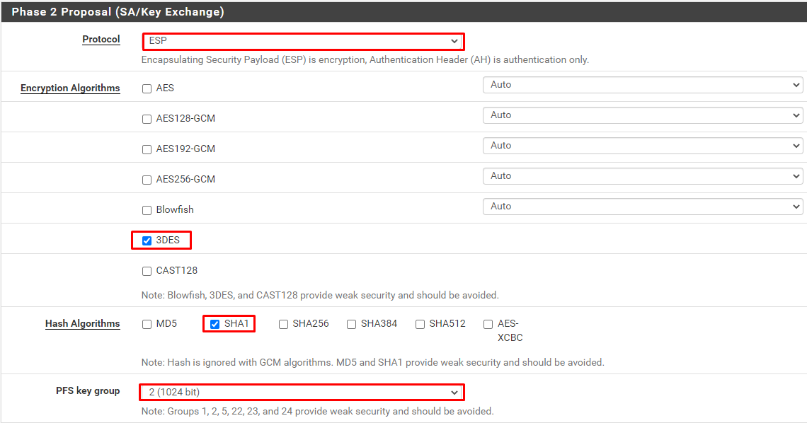

4. Chọn Save 

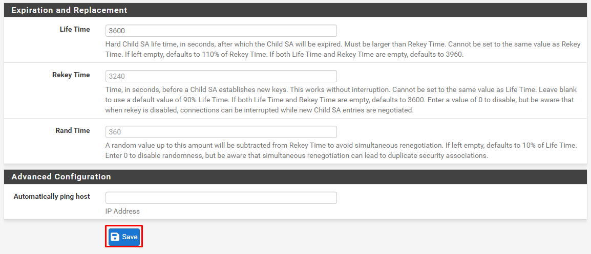

5. Chọn để Apply Changes để áp dụng thay đổi  

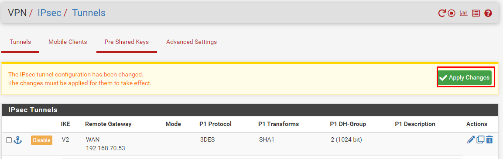
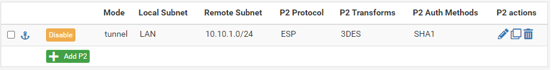

### 4.2.1 Trên MikroTik
1. Chúng ta cần định cấu hình Propocals Mikrotik Phase 2 để phù hợp với pfSense
- Từ phần mềm winbox, truy cập vào Mikrotik ta chọn IP → IPsec → Proposals và thêm proposal mới
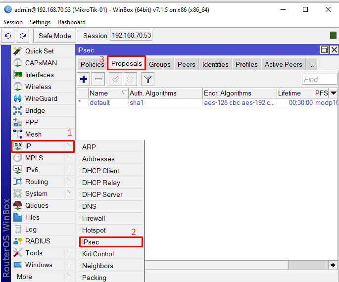

- Xác định kênh truyền giữa 2 điểm đầu cuối
  - **Name** : `pfsense` - tên của proposal
  - **Auth. Alorithms**: `sha1` - thuật toán hàm khóa xác thực
  - **Encr. Alorithms**: `3des` - Thuật toán mã hóa
  - **PFS Group**: `modp1048` - nhóm Diffie-Helman được sử dụng cho Perfect Forward Secrecy
  - **lifetime**: thời gian sử dụng SA trước khi vất bỏ 
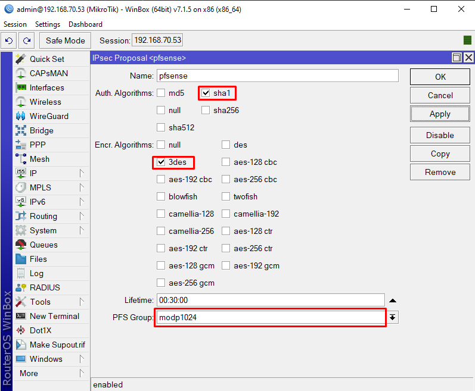

2. Tại tab Policies tạo policy cho  MikroTik
    - **tunnel**: `yes` - Chỉ định sử dụng chế độ tunnel, các gói ip gốc được đóng gói trong một gói ip mới và chúng đều được xác thực.
    - **Src. Address**: `10.10.1.0/24` - Địa chỉ dải mạng của VM-01. Áp dụng khi sử dụng tunnel
    - **Dst. Address**: `10.10.2.0/24` - Địa chỉ dải mạng của VM-02. Áp dụng khi sử dụng tunnel
    - **Action**: `encrypt` - Mã hóa dữ liệu truyền thông qua proposal được chọn  
    - **Level**: `require` - Chỉ định công việc khi không tìm thấy SA cho prolicy. 
    - **IPsec protocals**: `esp` - Lựa chọn giao thức IPsec.
    - **Proposal**: `pfsense` - lựa chọn Propopal
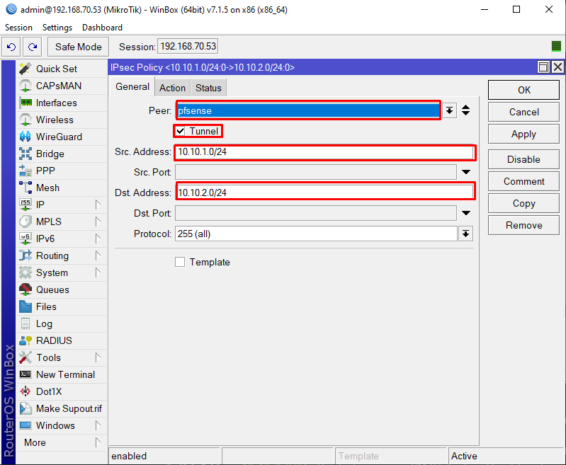
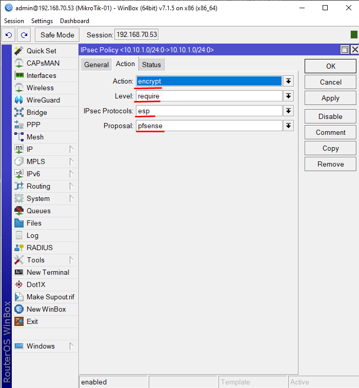

## 4.3 Cấu hình firewall 
## 4.3.1 Trên pfsense

1. Tại giao diện chọn Firewall -> Rules -> WAN -> Add. Thêm rule cho phép truy cập đến pfsense thông qua WAN
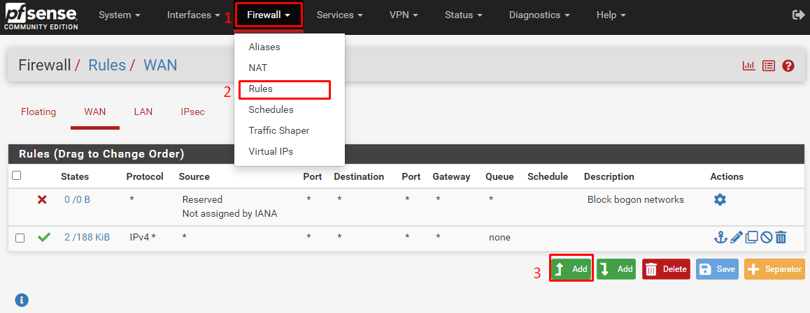
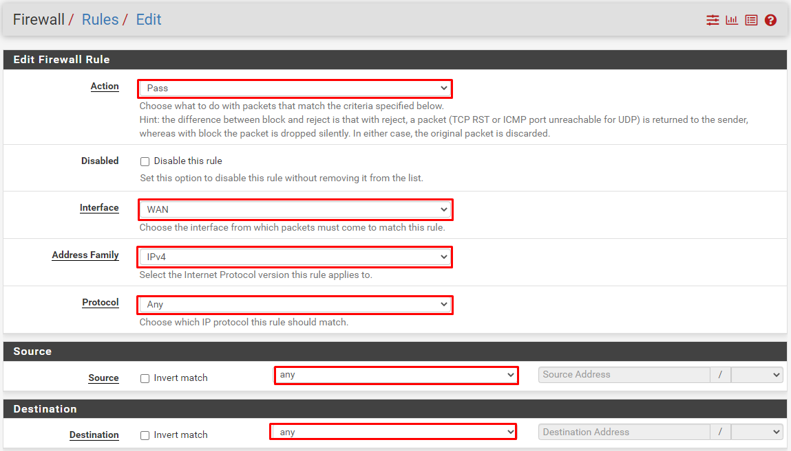

2.  Tiếp theo ta thiết lập rule cho IPsec. Chọn tab IPsec -> Add
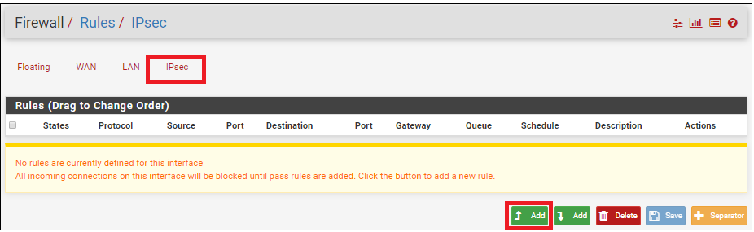

- Thực hiện Edit Rules để NAT giữa dải LAN của 2 Pfsense
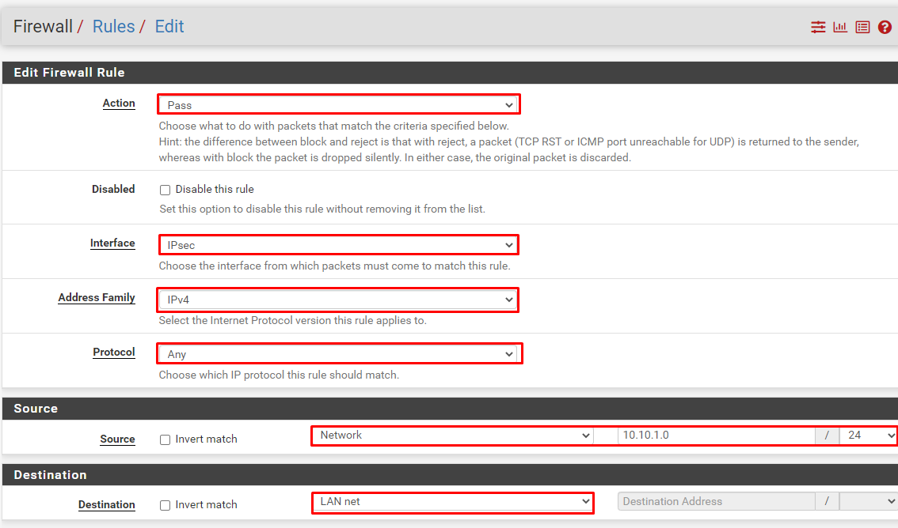

- Trong đó  
  - **Protocol**: `Any` – Cho phép toàn bộ giao thức
  - **Source**: `10.10.1.0/24` – Dải LAN phía Người dùng
  - **Destination**: `LAN net` – Dải LAN của VM trên SmartCloud

## 4.3.1 Trên MikroTik
1. Thêm 2 rule srcnat và dstnat trong IP → Firewall → NAT với action là accept mặc định và kéo lên trên rule NAT Internet:
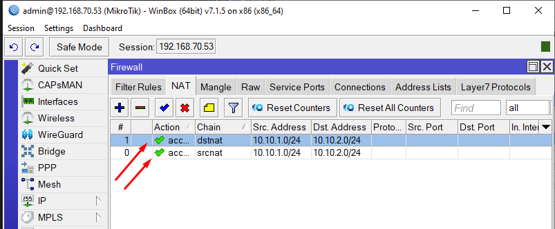

## 4.4 Thực hiện định tuyến giữa 2 VM 
1. Tại VM-01 thêm dải 10.10.2.0/24 thông qua địa chỉ 10.10.1.53 trên dev enp2s0

       ip route add 10.10.2.0/24 via 10.10.1.53 dev enp2s0

2. Tại VM-02 thêm dải 10.10.1.0/24 thông qua địa chỉ 10.10.2.54 trên dev enp2s0

       ip route add 10.10.1.0/24 via 10.10.2.54 dev enp2s0

## 4.5 Kiểm tra kết nối giữa 2 VM 
1. Tại VM-01

        ping 10.10.2.52
    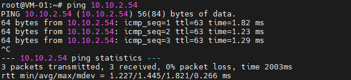

2. Tại VM-02 

        ping 10.10.1.53
    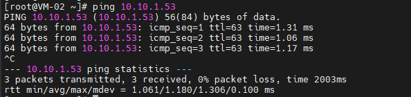

